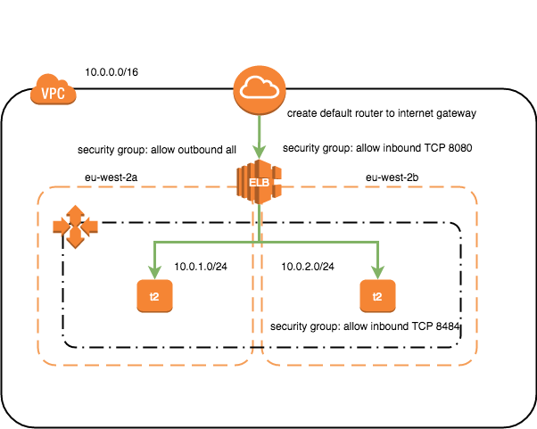

# simple-tf-demo
A simple terraform demo to create this:



## Usage ##
Prior to cloning this source code and running terraform plan or apply, you need to provide AWS credentials and the region
where you are are provisioning the infrastructure to the Terraform aws provider.

This can be done either by exporting them as environment variables in your shell e.g.
```
$ export AWS_DEFAULT_REGION=eu-west-2
$ export AWS_ACCESS_KEY_ID=xxxxx
$ export AWS_SECRET_ACCESS_KEY=xxxxx


$ git clone https://github.com/mjdilworth/simple-tf-app.git
$ cd stage/app-server
$ terraform get
$ terraform plan
$ terraform apply
```
N.B - run terraform get with `-update` flag if you have made changes to `vpc` module after initial run.
The modules are located here https://github.com/mjdilworth/tf-modules you dont need to download them as the terraform get command does this, but you can clone the repo.
OR

passing them as command line variables when running terraform plan or apply e.g.
```
$ git clone https://github.com/mjdilworth/simple-tf-app.git
$ cd stage/app-server
$ terraform plan -var region=eu-west-2 -var access_key=xxxxx -var secret_key=xxxxx
$ terraform apply
```
There are other ways of providing AWS credentials for authentications - see [here](https://www.terraform.io/docs/providers/aws/#authentication)

## Access the Application ##
Open a web browser and go to this URL:
```
The DNS name of the ELB will be displayed in your terminal as an output from the terraform apply command
http://${elb_dns_name}:8080
```
## Demonstrates ##
- The use of Terraform to build infrastructure
- The use of versioned modules (VPC)
- Some simple AWS features such as ELB and ASG
- The use of user data (perhaps inappropriately) to deploy and run a Go applications

## To-Do ##
- Create more modules
- move to a single code base to be used by different environments
- Use versioned S3 bucket for sate files
- Create a build pipeline for the Go application
- Create tests for the terraform
- Create a build pipeline for the terraform code
- other?
